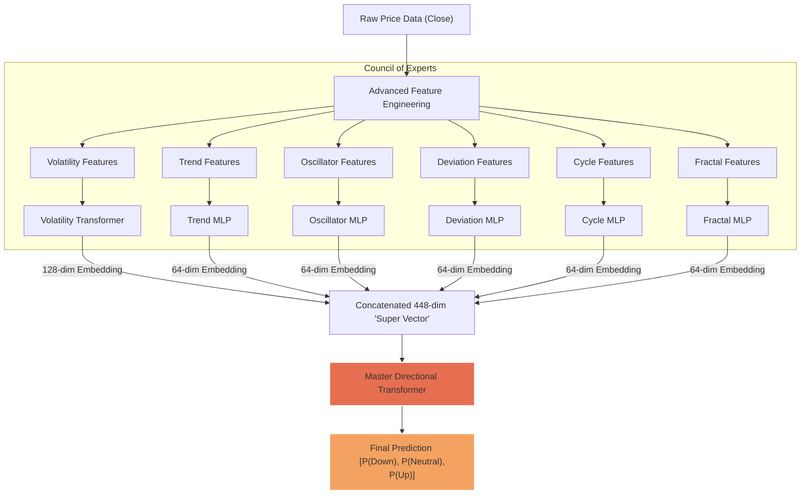

# ✨ Options-Zero-Game: A High-Fidelity Reinforcement Learning Environment for Autonomous Options Trading

**Options-Zero-Game** is a modular, and feature-rich reinforcement learning environment designed for training an autonomous options trading agent. Built within the [LightZero](https://github.com/opendilab/LightZero) framework, it leverages the powerful **MuZero** algorithm to learn, plan, and navigate a complex and realistic options market without prior knowledge of its rules.

The environment is architected to be a state-of-the-art research platform, featuring a dynamic and stochastic market, a sophisticated action space with intelligent adjustments, and a rich, high-dimensional observation space augmented by a hierarchical **"Council of Experts"**—a suite of specialized, pre-trained neural networks that provide the agent with deep market insights.

---

## 🏛️ Architectural Overview

The environment is designed with a clean separation of concerns, managed by a central orchestrator that interacts with the LightZero RL framework. The core principle is that each component is an expert in its domain, from market physics to financial mathematics.

```mermaid
graph TD
    A[Developer / Researcher] --> B{Key Scripts};
    B --> C[train_muzero.py];
    B --> D[options_zero_game_eval.py];
    B --> E[run_full_analysis.py];

    subgraph DI-engine / LightZero Framework
        C & D --> F[RL Training & Evaluation Loop];
    end

    F <--> G[OptionsZeroGameEnv];

    subgraph Environment Core
        G -- Manages --> H[PriceActionManager];
        G -- Manages --> I[PortfolioManager];
        G -- Manages --> J[MarketRulesManager];
        G -- Manages --> K[BlackScholesManager];
    end

    H -- Uses --> L["Council of Experts" AI System];

    style G fill:#2a9d8f,stroke:#fff,stroke-width:2px
    style F fill:#264653,stroke:#fff,stroke-width:2px
```



---

## 🌟 Key Features

### High-Fidelity Environment
*   **Modular Architecture**: The environment's logic is cleanly separated into specialized managers for price action, portfolio management, market rules, and Black-Scholes calculations, ensuring high maintainability and extensibility.
*   **Dynamic & Stochastic Market Physics**:
    *   **IV Regimes with Markov Chains**: The environment doesn't use a single IV skew. At the start of each episode, it selects a volatility regime (e.g., "Crisis (High Vol)", "Complacent") based on a stationary distribution derived from real market data, and the regime evolves from day to day according to a learned transition matrix.
    *   **GARCH or Historical Price Paths**: The `PriceActionManager` can generate new, unique price paths using a GARCH model or create episodes from random slices of a decade's worth of historical ticker data.

### Sophisticated & Intelligent Action Space
The agent possesses a powerful set of over 200 actions, including not just opening trades, but intelligently managing them.
*   **Complex Openings**: Opens a wide variety of strategies, from naked calls/puts to delta-neutral strangles, iron condors, and advanced structures like Jade Lizards.
*   **Risk-Based Adjustments**: A full suite of delta management actions that allow the agent to re-center its strategy (`RECENTER_VOLATILITY_POSITION`), roll a challenged leg to a more neutral strike (`HEDGE_PORTFOLIO_BY_ROLLING_LEG`), or add a new leg to neutralize delta (`HEDGE_DELTA_WITH_ATM_OPTION`).
*   **Strategy Morphing**: A full suite of `CONVERT_TO_*` actions that allow the agent to dynamically transform its position's structure (e.g., Strangle → Iron Condor, Butterfly → Vertical Spread) to adapt to changing market conditions.

### State-of-the-Art Hybrid AI System
The MuZero agent is augmented by a **"Council of Experts"**, a hierarchical system of neural networks that provide a rich, abstract feature set. This allows the final model to learn from expert opinions rather than just raw price data.

### Rich, Data-Driven Visualization
A powerful, web-based replayer built in React that provides a deep analysis of each episode, including:
*   An interactive P&L diagram with T+0 (current) and expiry curves.
*   Standard deviation bands on the payoff chart to show the expected market range.
*   A "Bias Meter" that synthesizes the agent's complex observation vector into a human-readable market bias.
*   A **Real-World Re-Simulation** panel to dynamically change parameters like start price, lot size, and strike distance to see how P&L would have been affected.

### Professional Analysis & Validation Suite
*   **Strategy Analyzer**: A complete analysis pipeline (`run_full_analysis.py`) that runs thousands of simulations to produce a ranked dashboard of every strategy, including advanced metrics like **Sharpe Ratio, Sortino Ratio, Calmar Ratio, Max Drawdown, and two forms of Elo Ranking (Standard and PnL-Weighted)**.
*   **Expert Evaluator**: Dedicated scripts (`unified_expert_evaluator.py`, `transformer_expert_trainer.py --mode eval`) to scientifically measure the predictive power of every expert model on unseen holdout data.
*   **Robust Regression Test Suite**: A full suite of over 30 tests (`regression_suite.py`) to validate the environment's core mechanics and prevent regressions.

---

## 🧠 The "Council of Experts" AI System

The core of the agent's intelligence comes from a hierarchical system where raw data is progressively transformed into abstract insights. The final Master Directional Transformer makes its decision by attending to the counsel of six specialist experts.


*   **Volatility Expert (Transformer)**: Analyzes a sequence of `[log_return, volatility, vol-of-vol, vol-autocorrelation]` to understand the market's risk profile.
*   **Trend, Oscillator, & Deviation Experts (MLPs)**: Use classic quantitative features (MA Slopes, Stochastic %K, Z-Score, etc.) to provide signals on trend, momentum, and mean-reversion potential.
*   **Cycle & Fractal Experts (MLPs)**: Use advanced statistical methods (Hilbert Transform, Hurst Exponent) to analyze the market's cyclical and fractal properties.
*   **Pattern Expert (MLP)**: Analyzes a sequence of lagged returns to identify recurring price action motifs.

---

## 🛠️ Core Technologies
*   **RL Framework**: LightZero / DI-engine
*   **RL Algorithm**: MuZero
*   **Neural Networks**: PyTorch
*   **Environment**: Gymnasium (formerly OpenAI Gym)
*   **Data & Numerics**: Pandas, NumPy, Numba
*   **Expert Models**: LightGBM, Scikit-learn, PyTorch (Transformers), `pandas_ta`, `hurst`
*   **Frontend Visualizer**: React, Chart.js

---

## 🚀 Setup and Standard Workflow

Follow these steps from the project's root directory to train the agent and view the results.

#### 1. Setup Python Environment
It is highly recommended to use a virtual environment.
```bash
python3 -m venv venv
source venv/bin/activate
pip install -r requirements.txt
```

#### 2. Setup Frontend UI
```bash
cd zoo/options_zero_game/visualizer-ui/
npm install
cd ../../../.. # Return to project root
```

#### 3. Build the Historical Data Cache
This script downloads ~10 years of daily data for ~1800 tickers. This only needs to be run once.
```bash
python3 zoo/options_zero_game/data/cache_builder.py
```

#### 4. Build the IV Regime Model
This script analyzes historical VIX data to create the Markov Chain for IV regime transitions. Run once.
```bash
python3 zoo/options_zero_game/experts/iv_regime_analyzer.py
```

#### 5. Train the "Council of Experts"
You must train the experts in the correct order.

```bash
# First, train the baseline Holy Trinity (for compatibility and feature generation)
python3 zoo/options_zero_game/experts/holy_trinity_trainer.py

# Second, train the upgraded Volatility Transformer
python3 zoo/options_zero_game/experts/transformer_expert_trainer.py --model_type volatility --epochs 10

# Third, train the five specialized MLP experts
python3 zoo/options_zero_game/experts/unified_expert_trainer.py --expert trend
python3 zoo/options_zero_game/experts/unified_expert_trainer.py --expert oscillator
python3 zoo/options_zero_game/experts/unified_expert_trainer.py --expert deviation
python3 zoo/options_zero_game/experts/unified_expert_trainer.py --expert cycle
python3 zoo/options_zero_game/experts/unified_expert_trainer.py --expert pattern

# Finally, train the Master Directional Transformer using the council's insights
python3 zoo/options_zero_game/experts/transformer_expert_trainer.py --model_type directional --epochs 10
```

#### 6. Train the MuZero Agent
This is the main training script. It includes automatic resumption logic.
```bash
# For a reproducible run with a fixed seed
python3 -u zoo/options_zero_game/config/options_zero_game_muzero_config.py --seed 42

# For a random seed
python3 -u zoo/options_zero_game/config/options_zero_game_muzero_config.py --seed -1
```

#### 7. Evaluate and Generate Replay Log
After training, copy the best checkpoint (e.g., `ckpt_best.pth.tar`) to the `./best_ckpt/` directory. Then, run the evaluation script.
```bash
# Example: Let the agent choose its own move on SPY data
python3 -u zoo/options_zero_game/entry/options_zero_game_eval.py --agents_choice --symbol SPY

# Example: Test the agent's management of a pre-configured Short Straddle
python3 -u zoo/options_zero_game/entry/options_zero_game_eval.py --portfolio_setup_file my_straddle_setup.json
```

#### 8. Build and Serve the Visualizer
First, build the static React app.
```bash
cd zoo/options_zero_game/visualizer-ui/
npm run build
cd ../../../.. # Return to project root
```
Then, run the Python server to view the results.
```bash
python3 zoo/options_zero_game/serve.py
```
Now, open your web browser to `http://<your-ip-address>:5001` to view the replay.

---

## 🔬 Advanced Usage & Analysis

The project includes a powerful suite of scripts for analysis and testing.

*   **Full Strategy Analysis**: Perform a deep statistical backtest on every strategy the agent knows, complete with advanced metrics and Elo rankings.
    ```bash
    # Run a fast, deterministic analysis with 50 episodes per strategy
    python3 zoo/options_zero_game/entry/run_full_analysis.py -n 50 --deterministic
    ```

*   **Expert Model Evaluation**: Scientifically measure the predictive power of your trained expert models on unseen holdout data.
    ```bash
    # Evaluate the final Master Directional Transformer
    python3 zoo/options_zero_game/experts/transformer_expert_trainer.py --model_type directional --mode eval

    # Evaluate one of the MLP experts
    python3 zoo/options_zero_game/experts/unified_expert_evaluator.py --expert trend
    ```

*   **Regression Test Suite**: Run a full suite of over 30 tests to validate the environment's core mechanics and prevent regressions.
    ```bash
    python3 zoo/options_zero_game/entry/regression_suite.py
    ```

---

## 📚 Future Work

This project provides a strong foundation for future research, including:

*   **Minimum Variance Portfolio Optimization**: Implement the `portfolio_optimizer.py` script we've planned. This would use the data from the strategy analyzer to find the optimal capital allocation across all of the agent's learned strategies, creating a robust "meta-portfolio" based on Modern Portfolio Theory.
*   **Stochastic MuZero**: Upgrade the agent to use the Stochastic MuZero algorithm to better handle the probabilistic nature of the market.
*   **Hierarchical Reinforcement Learning (HRL)**: Implement a two-level agent where a "Master" agent chooses the overall strategy (e.g., "Sell Volatility") and a "Slave" agent manages the execution and adjustments.
*   **Advanced Architectures**: Experiment with cutting-edge, long-sequence models like Mamba for the expert system.

---

## 📜 License
This project is licensed under the MIT License.
