# ✨ Options-Zero-Game: A Hierarchical RL Environment for Autonomous Options Trading

**Options-Zero-Game** is a feature-rich reinforcement learning environment designed for training a high-level, autonomous options trading agent. Built within the [LightZero](https://github.com/opendilab/LightZero) framework, it leverages the powerful **MuZero** algorithm to learn, plan, and make strategic decisions in a complex and realistic options market.

The core innovation of this architecture is its **hierarchical action space**. The RL agent does not execute trades directly; instead, it acts as a **strategic portfolio manager**. It analyzes the market using a sophisticated "Council of Experts" and decides on a high-level intent (e.g., `OPEN_BULLISH_POSITION`). A rule-based "Resolver" then takes this intent and executes the best-fit tactical trade (e.g., `OPEN_BULL_PUT_SPREAD`), freeing the agent to focus on mastering market dynamics and high-level strategy.

---

## 🏛️ Architectural Overview

The environment is built on a decoupled, hierarchical decision-making process. The MuZero agent forms a strategic opinion, which a tactical resolver then executes. This modularity allows for rapid experimentation with new trading strategies without retraining the core agent.

```mermaid
graph TD
    A[Developer / Researcher] --> B{Key Scripts};
    B --> C[train_muzero.py];
    B --> D[options_zero_game_eval.py];
    B --> E[run_full_analysis.py];

    subgraph DI-engine / LightZero Framework
        C & D --> F[RL Training & Evaluation Loop];
    end

    subgraph Agent's Decision Process
        F -- Chooses High-Level Intent --> G[Agent Action Space <br> e.g., OPEN_BULLISH_POSITION];
    end

    subgraph Environment Core
        G -- Sent to --> H{Action Resolver};
        H -- Selects & Executes --> I[Specific Strategy <br> e.g., OPEN_SHORT_PUT_ATM];
        I -- Modifies --> J[Portfolio & Market State];
    end
    
    J -- Generates --> K[High-Dimensional Observation];
    K -- Feeds into --> F;

    style G fill:#2a9d8f,stroke:#fff,stroke-width:2px
    style H fill:#e76f51,stroke:#fff,stroke-width:2px
    style F fill:#264653,stroke:#fff,stroke-width:2px
```



---

## 🌟 Key Features

*   **Hierarchical AI System**: The MuZero agent operates at a strategic level, choosing an abstract market view. A rule-based, tactical "Resolver" then selects and executes the most appropriate specific options strategy, simplifying the learning problem and enabling more robust, generalized policies.
*   **High-Fidelity Environment**:
    *   **Markov Chain Volatility Regimes**: The environment simulates realistic market shifts by transitioning between different volatility states (e.g., "Crisis," "Complacent") based on a model learned from a decade of VIX data.
    *   **Stochastic Price Paths**: Generates unique price histories using a GARCH model or creates episodes from slices of real historical ticker data.
*   **The "Council of Experts"**: A sophisticated deep learning pipeline that processes raw market data into a rich, high-dimensional state vector. This council of seven specialized neural networks provides the agent with deep, abstract insights into volatility, trend, momentum, and market cycles.
*   **Data-Driven Visualization**: A powerful, web-based replayer built in React that provides a deep analysis of each episode, including an interactive P&L diagram, per-leg live IV, a market "Bias Meter," and a **Real-World Re-Simulation** panel to perform "what-if" analysis.
*   **Professional Analysis & Validation Suite**: A complete backtesting pipeline (`run_full_analysis.py`) that simulates and ranks every low-level strategy based on advanced metrics like **Sharpe Ratio, Sortino Ratio, Calmar Ratio, and PnL-Weighted Elo Ranking**.

---

## 🧠 The "Council of Experts" AI System

The agent's market intelligence is derived from a hierarchical system where raw data is progressively transformed into abstract insights. The final Master Directional Transformer makes its decision by attending to the counsel of six specialist experts.


---

## 🛠️ Core Technologies
*   **RL Framework**: LightZero / DI-engine
*   **RL Algorithm**: MuZero
*   **Neural Networks**: PyTorch
*   **Environment**: Gymnasium (formerly OpenAI Gym)
*   **Data & Numerics**: Pandas, NumPy, Numba
*   **Expert Models**: PyTorch (Transformers), Scikit-learn, LightGBM
*   **Frontend Visualizer**: React, Chart.js

---

## 🚀 Setup and Standard Workflow

Follow these steps from the project's root directory to train the agent and view the results.

#### 1. Setup Python Environment
```bash
python3 -m venv venv
source venv/bin/activate
pip install -r requirements.txt
```

#### 2. Setup Frontend UI
```bash
cd zoo/options_zero_game/visualizer-ui/
npm install
cd ../../../.. # Return to project root
```

#### 3. Build the Historical Data Cache
This script downloads ~10 years of daily data. This only needs to be run once.
```bash
python3 zoo/options_zero_game/data/cache_builder.py
```

#### 4. Build and Tune the IV Regime Model
First, run the analyzer to learn from historical VIX data. Then, run the tuner to adjust the probabilities for a more balanced training experience.
```bash
# Run once
python3 zoo/options_zero_game/experts/iv_regime_analyzer.py

# Optional but highly recommended
python3 zoo/options_zero_game/experts/tune_iv_model.py
```

#### 5. Train the "Council of Experts"
You must train the experts in the correct order, as the Master Directional Transformer learns from the embeddings of the other six.
```bash
# First, train the baseline Holy Trinity (for compatibility and feature generation)
python3 zoo/options_zero_game/experts/holy_trinity_trainer.py

# Second, train the upgraded Volatility Transformer
python3 zoo/options_zero_game/experts/transformer_expert_trainer.py --model_type volatility --epochs 10

# Third, train the five specialized MLP experts
python3 zoo/options_zero_game/experts/unified_expert_trainer.py --expert trend
python3 zoo/options_zero_game/experts/unified_expert_trainer.py --expert oscillator
# ... (run for deviation, cycle, and pattern as well) ...

# Finally, train the Master Directional Transformer using the council's insights
python3 zoo/options_zero_game/experts/transformer_expert_trainer.py --model_type directional --epochs 10
```

#### 6. Train the MuZero Agent
This is the main training script. It uses the new hierarchical curriculum and includes automatic resumption logic.
```bash
# For a reproducible run with a fixed seed
python3 -u zoo/options_zero_game/config/options_zero_game_muzero_config.py --seed 42
```

#### 7. Evaluate and Generate Replay Log
After training, copy the best checkpoint to `./best_ckpt/`. Then, run the evaluation script.
```bash
# Let the agent choose its own high-level intent (e.g., OPEN_BULLISH_POSITION)
# The resolver will then pick the specific trade.
python3 -u zoo/options_zero_game/entry/options_zero_game_eval.py --agents_choice --symbol SPY

# To test a specific low-level strategy, bypassing the resolver
python3 -u zoo/options_zero_game/entry/options_zero_game_eval.py --strategy OPEN_SHORT_STRADDLE --symbol SPY
```

#### 8. Build and Serve the Visualizer
```bash
# Build the static React app (only need to do this once)
cd zoo/options_zero_game/visualizer-ui/
npm run build
cd ../../../.. # Return to project root

# Run the Python server to view the results
python3 zoo/options_zero_game/entry/visualizer_replayer.py
```
Now, open your web browser to `http://<your-ip-address>:5001` to view the replay.

---

## 🔬 Advanced Usage & Analysis

*   **Full Strategy Analysis**: Perform a deep statistical backtest on every low-level strategy the resolver knows.
    ```bash
    # Run a fast, deterministic analysis with 50 episodes per strategy
    python3 zoo/options_zero_game/entry/run_full_analysis.py -n 50 --deterministic
    ```

*   **Expert Model Evaluation**: Scientifically measure the predictive power of your trained expert models.
    ```bash
    # Evaluate the final Master Directional Transformer
    python3 zoo/options_zero_game/experts/transformer_expert_trainer.py --model_type directional --mode eval
    ```

*   **Regression Test Suite**: Run a full suite of tests to validate the environment's core mechanics.
    ```bash
    python3 zoo/options_zero_game/entry/regression_suite.py
    ```

---

## 📚 Future Work

This project provides a strong foundation for future research, including:
*   **Advanced Resolver Logic**: Enhance the rule-based resolver with more sophisticated logic, such as a utility-based model that scores candidate strategies based on risk/reward and market conditions.
*   **Stochastic MuZero**: Upgrade the agent to use the Stochastic MuZero algorithm to better handle the probabilistic nature of the market.
*   **Multi-Agent Systems**: Experiment with a two-agent HRL system where a "Master" agent (MuZero) selects the high-level intent and a "Slave" agent (e.g., a simpler DQN) learns the optimal execution tactic.

---

## 📜 License
This project is licensed under the MIT License.
